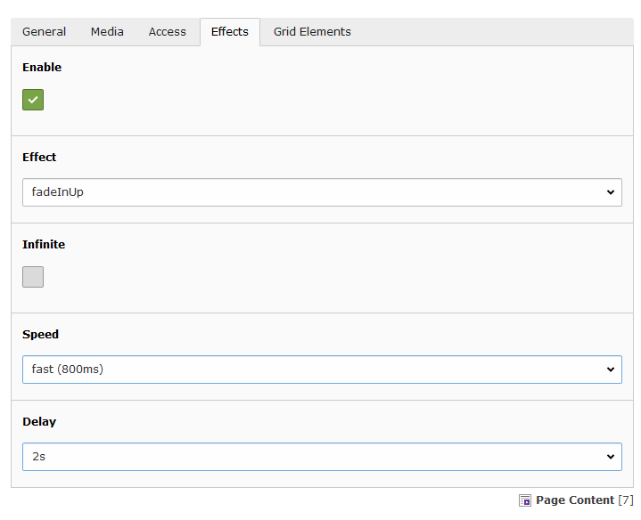

.. include:: ../Includes.txt

.. _introduction:

Introduction
============

.. _what-it-does:

What does it do?
----------------

This extension adds new fields to the content elements and includes the Animate.css and scrollfy jquery plugin.
Now it's simply possible to animate your site on scroll. You can also use this extension and effects for any other cases,
and not only for scroll effects. Take a look at the code, especially JavaScript (jQuery).

.. _screenshots:

Screenshots
-----------

The extension adds new fields to the Content Elements and let the user decide,
how they want to animate an content element on scrolling into view.

   These are the new possibilities for your users in the Backend on editing an content element.

Sources and Creator
-------------------

* Developer: `Hendrik Reimers (KERN23 / CORE23) <https://core23.com/>`_
* CSS3 Animations: `Animate.css <https://daneden.github.io/animate.css/>`_
* Scroll Effect: `jQuery Scrollfy Plugin  <https://github.com/hendrikreimers/scrollfy>`_